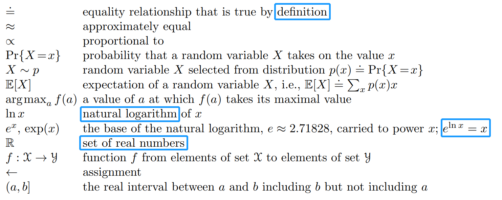

Here for some interesting links like RL fudamental books

http://incompleteideas.net/book/RLbook2018.pdf

Will keep reading and summarize some difficult or important concepts.

2020-09-01
First test on image:

Need to use the /blob/master/ not the /edit/master/ to set the absolute path of image. But using relative path would be beeter.
